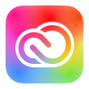
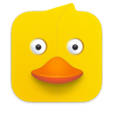
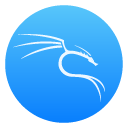
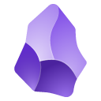
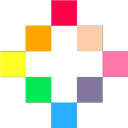
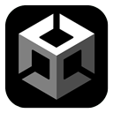

# Hi, I'm JC! 👋

## About Me
I am a versatile front-end developer with a passion for innovation and interactive experiences. With hands-on experience in digital learning, I bring a fresh perspective to software development and IT consulting.

## Software I use

||||||||||||||||||
|-|-|-|-|-|-|-|-|-|-|-|-|-|-|-|-|-|
|Adobe Creative Cloud|Aseprite|Cyberduck|Dbeaver|WSL Debian|Docker|Gitkraken|Intellij Idea|Kali Linux|Meld|Notepad++|Obsidian|Pico8|Postman|Unity|VS Code|Zed|

<table>
  <tr>
    <td align="center"> Adobe Creative Cloud</td>
    <td align="center"> Aseprite</td>
    <td align="center"> Cyberduck</td>
    <td align="center"> Dbeaver</td>
    <td align="center"> WSL Debian</td>
    <td align="center"> Docker</td>
  </tr>
  <tr>
    <td align="center"> GitKraken</td>
    <td align="center"> IntelliJ IDEA</td>
    <td align="center"> Kali Linux</td>
    <td align="center"> Meld</td>
    <td align="center"> Notepad++</td>
    <td align="center"> Obsidian</td>
  </tr>
  <tr>
    <td align="center"> Pico-8</td>
    <td align="center"> Postman</td>
    <td align="center"> Unity</td>
    <td align="center"> VS Code</td>
    <td align="center"> Zed</td>
  </tr>
</table>
