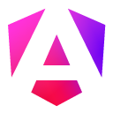

# Hi, I'm JC! 👋

## 🚀 About Me

I am a versatile front-end developer with a passion for innovation and interactive experiences. With hands-on experience in digital learning, I design and develop solutions that enhance interactivity and accessibility.

## 🛠️ Skills

Here are the technologies and frameworks I like working with right now:

<table>
  <tr>
    <td><strong>Front-End</strong></td>
    <td>
       HTML, 
       CSS, 
       JavaScript, 
       TypeScript, 
       Angular, 
       React
    </td>
  </tr>
  <tr>
    <td><strong>Back-End</strong></td>
    <td>
       Java (Spring Boot), 
       Python
    </td>
  </tr>
  <tr>
    <td><strong>Databases</strong></td>
    <td>
       MySQL, 
       PostgreSQL
    </td>
  </tr>
  <tr>
    <td><strong>Tools</strong></td>
    <td>
       Git, 
       Docker, 
       Postman
    </td>
  </tr>
</table>

## 🖱️ Software I use

Below are the tools that help me develop and deliver my projects:

<table>
  <tr>
    <td><strong>Development</strong></td>
    <td>
      <a href="https://www.jetbrains.com/idea/">
         IntelliJ IDEA
      </a>, 
      <a href="https://code.visualstudio.com/">
         VS Code
      </a>, 
      <a href="https://unity.com/">
         Unity
      </a>
    </td>
  </tr>
  <tr>
    <td><strong>DevOps</strong></td>
    <td>
      <a href="https://www.docker.com/">
         Docker
      </a>, 
      <a href="https://www.gitkraken.com/">
         GitKraken
      </a>, 
      <a href="https://www.postman.com/">
         Postman
      </a>
    </td>
  </tr>
  <tr>
    <td><strong>Design & Productivity</strong></td>
    <td>
      <a href="https://www.adobe.com/creativecloud.html">
         Adobe Creative Cloud
      </a>, 
      <a href="https://obsidian.md/">
         Obsidian
      </a>
    </td>
  </tr>
</table>

## 📬 Let's Connect

- Check out my portfolio for more about my work: [devjck.fr](https://devjck.fr)
- Let's connect on [linkedin](https://www.linkedin.com/in/devjck/) to discuss tech, projects, or job opportunities!
