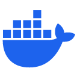
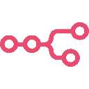
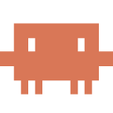
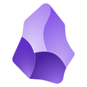

# Hi, I'm JC! 👋

## 🚀 About Me

I am a dedicated developer with a passion for innovation and interactive experiences. With hands-on experience in UI/UX, I design and develop solutions that enhance interactivity and accessibility.

## 🛠️ Technical Stack

Here are the technologies and frameworks I like working with right now:

<table>
  <tr>
    <td><strong>Front-End</strong></td>
    <td>
       Next.js ,
       React, 
       TypeScript, 
       Tailwind
    </td>
  </tr>
  <tr>
    <td><strong>Back-End</strong></td>
    <td>
       Python, 
       FastAPI, 
       Docker, 
       n8n
    </td>
  </tr>
  <tr>
    <td><strong>Databases</strong></td>
    <td>
       SQLite, 
       PostgreSQL
    </td>
  </tr>
  <tr>
    <td><strong>AI Coding Tools</strong></td>
    <td>
       Claude Code, 
       Gemini
    </td>
  </tr>
</table>

I enjoy using  Obsidian for documentation and  Jira for project management.

## 📬 Let's Connect

- Check out my portfolio for more about my work: [devjck.fr](https://devjck.fr)
- Let's connect on [linkedin](https://www.linkedin.com/in/devjck/) to discuss tech, projects, or job opportunities!
