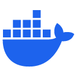

# Hi, I'm JC! 👋

## 🚀 About Me
I am a versatile front-end developer with a passion for innovation and interactive experiences. With hands-on experience in digital learning, I bring a fresh perspective on development and IT consulting.

## 🛠️ Skills

- Front-End Development: HTML, CSS, JavaScript, Angular, React
- Back-End Development: Java, Python
- Databases: MySQL, PostgreSQL
- Tools: Git, Docker

## 🖱️ Software I use

<table>
  <tr>
    <td><strong>🎨 Design & Multimedia</strong></td>
    <td>
      <a href="https://www.adobe.com/creativecloud.html">
         Adobe CC
      </a>, 
      <a href="https://www.aseprite.org/">
         Aseprite
      </a>
    </td>
  </tr>
  <tr>
    <td><strong>💻 Development & Programming</strong></td>
    <td>
      <a href="https://www.jetbrains.com/idea/">
         IntelliJ IDEA
      </a>, 
      <a href="https://code.visualstudio.com/">
         VS Code
      </a>, 
      <a href="https://zed.dev/">
         Zed
      </a>, 
      <a href="https://www.lexaloffle.com/pico-8.php">
         Pico-8
      </a>, 
      <a href="https://unity.com/">
         Unity
      </a>
    </td>
  </tr>
  <tr>
    <td><strong>🛠️ DevOps & Tools</strong></td>
    <td>
      <a href="https://www.docker.com/">
         Docker
      </a>, 
      <a href="https://www.gitkraken.com/">
         GitKraken
      </a>, 
      <a href="https://www.postman.com/">
         Postman
      </a>, 
      <a href="https://meldmerge.org/">
         Meld
      </a>
    </td>
  </tr>
  <tr>
    <td><strong>🌐 Operating Systems & Utilities</strong></td>
    <td>
      <a href="https://www.kali.org/">
         Kali Linux
      </a>, 
      <a href="https://www.debian.org/">
         WSL Debian
      </a>, 
      <a href="https://notepad-plus-plus.org/">
         Notepad++
      </a>, 
      <a href="https://obsidian.md/">
         Obsidian
      </a>
    </td>
  </tr>
  <tr>
    <td><strong>📂 Data & File Management</strong></td>
    <td>
      <a href="https://dbeaver.io/">
         DBeaver
      </a>, 
      <a href="https://cyberduck.io/">
         Cyberduck
      </a>
    </td>
  </tr>
</table>

## 📬 Let's Connect

- LinkedIn: [linkedin.com/in/devjck/](https://www.linkedin.com/in/devjck/)
- Portfolio: [devjck.fr](https://devjck.fr)